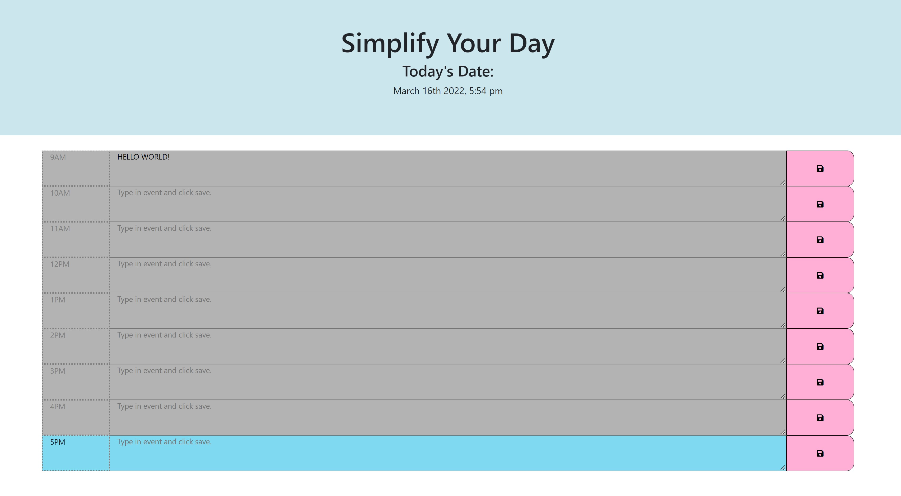

# Daily Work Planner

## Description
Create a planner that allows you to save events for each hour of the day on a calendar. This planner enables an employee with a busy schedule to add important events so that they can manage their time effectively. You will be utilizing the Moment.js library to work with date and time. 

## Task 
To schedule events on a daily planner, the following requirements are met when:
- The current day is displayed at the top of the calendar.
- There are timeblocks for each hour displayed.
- Each timeblock is color coded to indicate past, present, and future time for that day.
- An event can be entered when the timeblock is clicked.
- The event entered is then saved in local storage after clicking the save button.
- The data for the event entered is still displayed when there is a page refresh.

## Usage
This program can be run through a browser to the the deployed application. Alternatively, to run this application locally you will need to:

1. Clone this repository to receive all of the files.
2. Make sure you are in the directory of the application. It should be in a folder named daily-work-planner.
3. Right-click on the index.html file
4. Click on `Open in Default Browser`
5. The browser should render the web page

## Screenshot

## Link to the Final Page
[Link to the final work planner]https://inna-arabejo.github.io/daily-work-planner/

## Sources
- https://momentjs.com/
- https://www.youtube.com/watch?v=fNcJuPIZ2WE
- https://getbootstrap.com/docs/4.6/layout/overview/#fluid
- https://stackoverflow.com/questions/62904905/how-do-i-color-code-time-blocks-using-js

